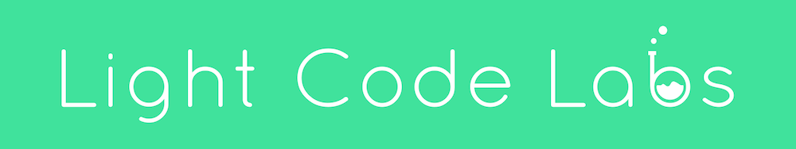
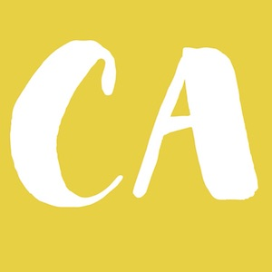

# Go in 5 Minutes Financial Contributors

Go in 5 Minutes is a screencast series [I](https://github.com/arschles) created because
I believe short, focused screencasts are one of the best ways to help Gophers all over
the world advance their skills.

The concepts I've covered have helped developers get involved in the community, get a new
Go job, or just learn something new. Over 3000 Gophers have benefitted from the content
so far.

Financial contributions help pay for development of new material and production of new screencasts.

If you or your company has benefitted from the lessons that Go in 5 Minutes teaches, please consider financially supporting the screencast by buying my lessons:

- [The Ultimate Guide to Web Apps in Go](https://gum.co/hgHhj?wanted=true) - A subscription series that dives deep into the nuts and bolts of building full-stack web apps in Go. Since this is a subscription, you'll always be up to date on the latest in the fast moving world of Go web apps
- [The bundle of the first 10 episodes](https://gumroad.com/l/gifm-1-10?wanted=true) - A bundle of the first 10 episodes. All are DRM-free, HD, and you can download them and watch them anywhere. If you're just getting started with Go, I recommend this!

# Sponsors

### [Light Code Labs](https://www.lightcodelabs.com/)

### [Care Anywhere](https://careanywhereapp.com)

## [Your Company Here](https://patreon.com/goin5minutes)

# Backers

## [Your Company Here](https://patreon.com/goin5minutes)
